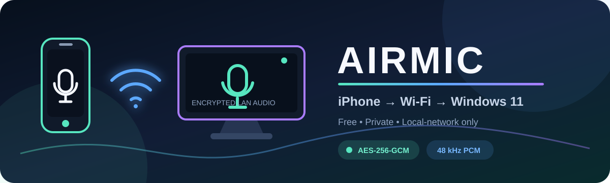

<p align="center">
  
</p>

<p align="center">
  
  
  
  
</p>

<p align="center">
  
  
  
  
</p>

<p align="center">
  <a href="#features-in-this-milestone">Features</a> •
  <a href="#run-the-mvp">Quick Start</a> •
  <a href="docs/ARCHITECTURE.md">Architecture</a> •
  <a href="docs/SECURITY.md">Security</a> •
  <a href="docs/MANUAL_TESTS.md">Test Checklist</a>
</p>

---

AirMic is a free, account-free, LAN-only microphone bridge:

**iPhone microphone → local Wi-Fi → Windows 11 → virtual microphone → Discord, Meet, Zoom, Teams, OBS, browsers, and games**

Audio is captured with AVFoundation, packetized as voice-optimized mono PCM,
encrypted per datagram, and received by a native .NET 8 Windows application.
There is no cloud media server, subscription, analytics SDK, or microphone
recording.

> [!IMPORTANT]
> AirMic is currently an **MVP source milestone**, not a production release binary. The encrypted iPhone-to-PC pipeline is implemented; the Microsoft-signed virtual audio driver remains the release gate.

## Project status

This repository is the first runnable MVP source milestone, not a production
release binary.

| Area | Status |
| --- | --- |
| Protocol, 48 kHz PCM packetization, AES-GCM, tamper rejection | Implemented; cross-platform smoke tests pass |
| iOS SwiftUI, permission, AVAudioEngine capture, level, gain/gate, Bonjour, manual IP, PIN, mute, reconnect | Implemented in source; requires Xcode/macOS hardware verification |
| Windows TLS pairing, PIN rate limit, mDNS advertisement, encrypted UDP receive, jitter buffer, level/latency diagnostics | Implemented in source; requires Windows 11/.NET verification |
| Windows local speaker preview | Implemented for MVP pipeline testing |
| WPF dashboard, tray, opt-in startup, structured local logs | Implemented in source |
| `AirMic Virtual Microphone` driver | Architecture and strict release gate defined; driver source/signature not yet complete |
| Production installer | Defined, but intentionally refuses to build without a signed driver package |

The virtual microphone is the hardest part. Windows applications can only see
a new recording endpoint when a Windows audio driver exposes it. NAudio/WASAPI
cannot create that endpoint from user mode. The production design therefore
uses a minimal signed WaveRT virtual cable based on Microsoft's SysVAD
architecture. See [Architecture](docs/ARCHITECTURE.md) and the
[driver release gate](windows/AirMic.Driver/README.md).

## Features in this milestone

- 16, 24, and 48 kHz mono PCM settings; 48 kHz uses 10 ms packets under MTU.
- TLS 1.2+ pairing and a rate-limited six-digit PIN.
- Random per-session 256-bit key and AES-256-GCM authenticated UDP audio.
- Replay window, adaptive jitter buffer, packet-loss tracking, digital silence
  on missing audio, gain, gate, mute, and iOS voice processing when supported.
- Bonjour/mDNS discovery plus manual local IP fallback.
- Human-readable connection, permission, firewall, and driver states.
- Windows system tray, opt-in startup, diagnostics copy, and JSONL local logs.
- iPhone screen stays awake while streaming and the UDP path reconnects after
  temporary Wi-Fi interruption.
- No accounts, cloud, NAT traversal, audio files, or paid APIs.

## Repository layout

```text
AirMic/
├── ios/                 SwiftUI + AVFoundation client
├── windows/             .NET 8 WPF receiver, tests, and driver gate
├── shared/              Protocol v1 and cross-language vectors
├── docs/                Architecture, security, and manual tests
├── scripts/             Verification commands
├── installer/           Signed-driver-gated Inno Setup installer
└── .github/workflows/   Windows, iOS, and protocol CI
```

## Requirements

### iPhone

- iPhone running iOS 17 or later (target hardware: iPhone 14).
- macOS with current Xcode and [XcodeGen](https://github.com/yonaskolb/XcodeGen).
- A free Apple ID is enough for on-device development signing; App Store
  distribution has Apple's normal developer requirements.

### Windows

- Windows 11 x64, Private network profile, .NET 8 SDK for development.
- Visual Studio 2022/2026 with .NET desktop tools.
- Visual Studio + WDK and a dedicated test machine for driver development.
- Both devices on the same Wi-Fi subnet; client isolation must be off.

## Run the MVP

### 1. Windows receiver

```powershell
dotnet restore .\windows\AirMic.sln
dotnet run --project .\windows\AirMic.Windows\AirMic.Windows.csproj
```

Allow TCP 51243 and UDP 51244 on the **Private** firewall profile. The dashboard
shows a rotating six-digit PIN. Until the AirMic driver exists, enable
`Play local preview through PC speakers` to verify the real iPhone → LAN → PC
audio pipeline.

### 2. iPhone client

```bash
cd ios
xcodegen generate
open AirMic.xcodeproj
```

Select the AirMic target, choose your Apple development team and connected
iPhone, then Run. Approve Microphone and Local Network access. Select the PC,
enter the PIN shown on Windows, and tap **Connect Securely**. If Bonjour is
blocked, enter the PC's local IPv4 address manually.

### 3. Verify

```bash
bash scripts/verify.sh
```

On Windows, also run:

```powershell
dotnet test .\windows\AirMic.sln --configuration Release
```

Protocol checks cover header parsing, AES-GCM round-trip/tampering, MTU size,
replay rejection, PIN rate limiting, jitter/reordering, packet loss, gain/gate,
resampling, and LAN address filtering. Platform build tests are separated
because WPF/WDK require Windows and iOS requires macOS/Xcode.

## Pairing and security

1. Windows advertises `_airmic._tcp.local` without secrets.
2. iPhone opens a TLS control connection and sends the user-entered PIN.
3. Windows allows five attempts per address per five minutes, then locks out.
4. A successful pair returns an in-memory session ID and 256-bit audio key.
5. iPhone pins the receiver certificate and sends authenticated AES-GCM UDP.
6. Windows accepts packets only from the paired private-LAN address and rejects
   duplicate, stale, malformed, wrong-session, or modified packets.

The first-pair threat model and certificate limitation are documented in
[Security](docs/SECURITY.md). Use AirMic only on a trusted private network.

## Virtual microphone and installer

The release driver exposes two endpoints:

- `AirMic Network Input` — private render endpoint used by the Windows app.
- `AirMic Virtual Microphone` — recording endpoint selected by other apps.

The installer requires administrator permission, a valid signed INF, and adds
Private-profile firewall rules only. It creates no Windows service. Uninstall
removes the driver package, endpoints, firewall rules, shortcuts, and app files.
The installer compile intentionally fails if the signed driver is absent.

## Using AirMic after the signed driver is installed

- **Discord:** User Settings → Voice & Video → Input Device → AirMic Virtual Microphone.
- **Google Meet:** More options → Settings → Audio → Microphone → AirMic Virtual Microphone.
- **Zoom:** Settings → Audio → Microphone → AirMic Virtual Microphone.
- **Teams:** Settings → Devices → Microphone → AirMic Virtual Microphone.
- **OBS:** Sources → Add → Audio Input Capture → AirMic Virtual Microphone.
- **Games/browsers:** select AirMic in the app, or set it as the Windows default communications input.

## Troubleshooting

### iPhone not found / PC not found

Confirm both devices use the same Wi-Fi, the Windows network profile is
Private, AP/client isolation is off, and Local Network access is enabled under
iPhone Settings → AirMic. Try manual IPv4 entry if mDNS is blocked.

### Wrong PIN / too many attempts

Use the current PIN shown on the Windows dashboard. It rotates after a
successful pairing and periodically. After five failures, wait 30 seconds.

### Microphone permission denied

Open iPhone Settings → Privacy & Security → Microphone and enable AirMic.

### Firewall blocked

Allow the AirMic executable on Private networks for TCP 51243 and UDP 51244.
Do not expose these ports on a Public profile or forward them on the router.

### Virtual microphone unavailable

The signed AirMic driver is not installed or failed to start. Local preview
tests the network pipeline but does not create a recording endpoint. Check
Device Manager and AirMic Diagnostics; never enable Windows test mode on an
end-user PC.

### Choppy audio or high latency

Use 5 GHz/6 GHz Wi-Fi, move closer to the access point, stop heavy LAN
transfers, and try 24 kHz. The jitter buffer adapts between roughly 20–100 ms.

## Diagnostics and privacy

Windows Diagnostics reports LAN reachability, discovery, pairing, active audio,
virtual endpoint state, sample rate, channel count, packets/sec, approximate
latency, and packet loss. `Copy Diagnostics` never includes a PIN, session key,
certificate private key, or audio bytes. Logs contain state transitions and
error types only; microphone audio is never logged or stored.

## Dependencies and licenses

- [NAudio](https://github.com/naudio/NAudio), MIT, user-mode Windows audio.
- [Microsoft Windows driver samples / SysVAD](https://github.com/microsoft/Windows-driver-samples/tree/main/audio/sysvad), used as the driver architecture reference; retain upstream notices when driver code is imported.
- [XcodeGen](https://github.com/yonaskolb/XcodeGen), MIT, development-only project generation.
- Inno Setup for packaging under its distribution terms.
- Apple AVFoundation/Network/CryptoKit and Microsoft .NET/Windows APIs.

No third-party microphone service is used.

## Release checklist

Before calling AirMic production-ready, all platform CI must pass, the driver
must be Microsoft-signed, and every item in [Manual tests](docs/MANUAL_TESTS.md)
must be completed on a physical iPhone 14 and clean Windows 11 PC.

## License

AirMic application code is available under the [MIT License](LICENSE).
Bundled dependencies and any future imported driver sample code retain their
own notices.
