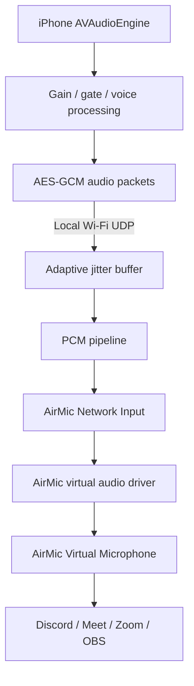

# Architecture

## Why the virtual microphone is the hard part

WPF, NAudio, WASAPI, and Windows AudioGraph can open existing endpoints, but
they cannot register a new system-wide recording endpoint. A selectable
`AirMic Virtual Microphone` therefore requires a Windows audio driver. AirMic's
release design is a minimal WaveRT virtual cable derived from Microsoft's
SysVAD architecture:

1. `AirMic Network Input` is a render endpoint opened only by the AirMic app.
2. `AirMic Virtual Microphone` is the capture endpoint applications select.
3. The driver copies the render stream into the capture ring buffer without
   routing it to speakers.

The driver must be built with Visual Studio + WDK and signed for normal x64
Windows 11 installation. Test signing is development-only. Release packaging
must never disable Secure Boot or silently enable Windows test mode.

## Data flow

## Transport choice

AirMic v1 uses a TLS control channel and encrypted UDP audio instead of WebRTC:

- WebRTC gives excellent congestion control and voice DSP, but embeds a large
  native dependency on both iOS and Windows and still needs custom LAN
  signaling.
- WebTransport/QUIC has good security but platform interop and certificate
  bootstrapping are harder for a no-server, first-run LAN pairing flow.
- Raw TCP audio suffers head-of-line blocking after packet loss.
- Small UDP PCM frames keep latency predictable. TLS performs pairing and
  delivers a per-session key; AES-GCM authenticates every datagram.

This is deliberately a LAN voice transport, not an internet streaming
protocol. The app binds to local interfaces, does not perform NAT traversal,
and never contacts a signaling or media server.

## Components

- `ios/AirMic`: SwiftUI app, microphone capture, DSP, discovery, secure pairing,
  packetization, reconnect, and UI.
- `windows/AirMic.Core`: protocol, receiver, jitter buffer, DSP, diagnostics,
  and virtual endpoint bridge.
- `windows/AirMic.Windows`: WPF dashboard and tray application.
- `windows/AirMic.Driver`: driver contract and WDK release gate.
- `installer`: Inno Setup packaging definition; release builds require a
  signed driver package.
- `shared`: protocol and cross-language test vectors.

## Current verification boundary

Protocol-level tests can run on any OS. The WPF application must be built and
tested on Windows 11; the iOS application must be built and tested with Xcode
on macOS and a physical iPhone. The kernel driver and installer require a
Windows 11 WDK test machine. CI intentionally reports these as separate gates.
